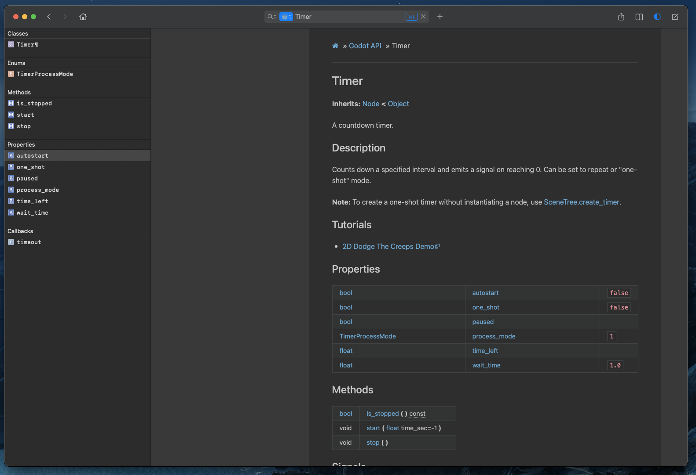

# Godot Dash Docset

A script for converting [godot](https://docs.godotengine.org/en/stable/)'s official doc into [Dash](https://kapeli.com/dash)'s docset.

## Usage

1. `git clone git@github.com:godotengine/godot-docs.git`
2. `pip install -r requirements.txt`
3. `make html`
4. `cd _build`
5. `pip install beautifulsoup4`
6. `mkdir -p Godot.docset/Contents/Resources/Documents/`
7. `cp -r html/* Godot.docset/Contents/Resources/Documents/`
8. add [`Info.plist`](https://kapeli.com/docsets#infoplist)
9. `python3 build.py`
10. add [Icon](https://kapeli.com/docsets#addingicon)
11. Double click `Godot.docset` to install
